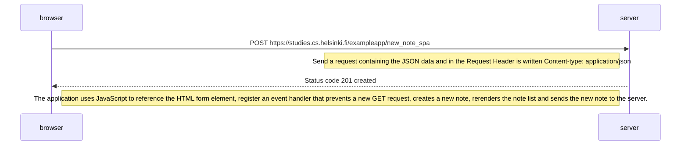

```mermaid
sequenceDiagram
    participant browser
    participant server

    browser->>server: POST https://studies.cs.helsinki.fi/exampleapp/new_note_spa
    activate server
    Note left of server: Send a request containing the JSON data and in the Request Header is written Content-type: application/json
    server-->>browser: Status code 201 created
    Note right of browser: The application uses JavaScript to reference the HTML form element, register an event handler that prevents a new GET request, creates a new note, rerenders the note list and sends the new note to the server.
```
